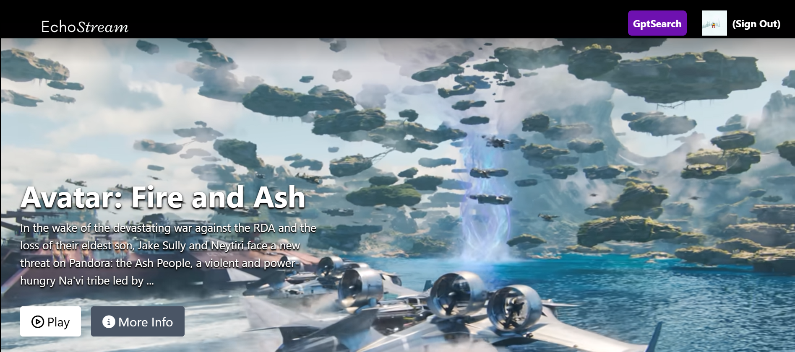
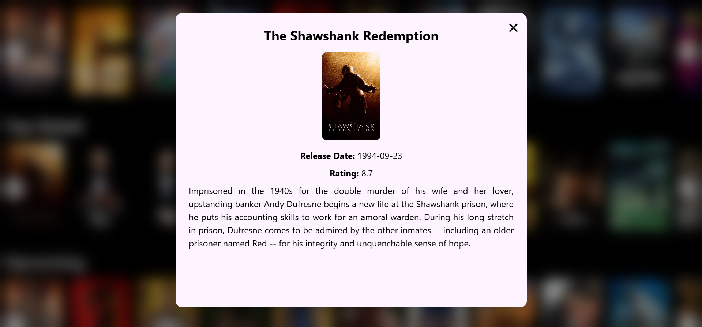

# 🎬 EchoStream


<br />

<div align="center">
  <strong>Intelligent media discovery powered by Google Gemini AI and TMDb.</strong>
</div>

<!-- <div align="center">
  <a href="YOUR_LIVE_DEMO_LINK_HERE">
    
  </a>
  <a href="YOUR_REPO_LINK_HERE/issues">
    
  </a>
</div>

<br /> -->

## About The Project

**EchoStream** is an intelligent, immersive media discovery platform designed to solve the "choice paralysis" users face when navigating vast streaming libraries.

By fusing the comprehensive metadata of the **TMDb API** with the generative reasoning of **Google's Gemini AI**, EchoStream doesn't just list movies—it understands user intent, offering context-aware recommendations and a seamless, tailored browsing experience.

## Previews

<div align="center"> 
  
  <br>
  <em>Home Page Dashboard</em>
</div>

<br>

<div align="center">
  
  <br>
  <em>AI-Powered Description View</em>
</div>

---

## Key Features & Impact

- **AI-Powered Curation:** Leverages **Gemini AI** to move beyond simple genre matching, providing nuanced recommendations based on plot, mood, and thematic elements.
- **Blazing Fast UI:** Built on **Vite** and **React**, ensuring near-instant page loads and smooth transitions even when rendering heavy media assets.
- **Secure Authentication:** Integrated **Firebase Authentication** for a robust, serverless identity management system that handles user sessions securely.
- **Responsive Design:** A mobile-first approach using **Tailwind CSS**, ensuring the interface is sleek and accessible across all device sizes.
- **State Management:** Utilizes **Redux Toolkit** for predictable state flow, effectively managing complex data streams like user watch history and API caching.

---

## Tech Stack

### Frontend Client

- **Framework:** React.js (v18+)
- **Build Tool:** Vite (for HMR and optimized bundling)
- **Styling:** Tailwind CSS
- **Routing:** React Router DOM
- **State Management:** Redux Toolkit
- **HTTP Client:** Axios / Fetch API

### Backend & Services

- **Runtime:** Node.js (Express)
- **Authentication:** Firebase Auth
- **AI Integration:** Google Gemini API
- **Data Source:** The Movie Database (TMDb) API

---

## 📂 Project Architecture

The project follows a decoupled client-server architecture.

```bash
EchoStream/
├── backend/                # Node.js Server Layer
│   ├── controllers/        # Request handlers for different routes
│   ├── routes/             # API route definitions
│   ├── index.js            # Entry point for backend logic
│   └── package.json        # Backend dependencies
├── frontend/               # React Client Layer
│   ├── src/
│   │   ├── components/     # Reusable UI atoms and molecules
│   │   ├── hooks/          # Custom React hooks for logic reuse
│   │   ├── utils/          # Helper functions,constants and Redux slices and store configuration
│   │   └── App.jsx         # Root component
│   │   └── main.jsx        # Application entry point
│   └── index.html          # HTML template
│   └── vite.config.js      # Vite configuration
│   └── package.json        # Frontend dependencies
└── firebase.json           # Firebase hosting/config
└── README.md               # Project documentation
```

## Installation & Setup

```
1. **Clone the Repository:**
# Clone the repo
git clone [https://github.com/your-username/echostream.git](https://github.com/your-username/echostream.git)

# Install Backend Deps
cd echostream/backend
npm install

# Install Frontend Deps
cd ../frontend
npm install

2. **Set Up Environment Variables:**
   - VITE_TMDB_API_KEY=your_tmdb_key_here
   - VITE_GOOGLE_API_KEY=your_gemini_key_here

3. **Run the Application:**
   - Start Backend Server:
      cd echostream/backend
      npm run dev
   - Start Frontend Client:
      cd ../frontend
      npm run dev

```

## 🤝 Contributing

Contributions are welcome! Please fork the repository and create a pull request with your features or fixes.

1. Fork the Project
2. Create your Feature Branch (git checkout -b feature/AmazingFeature)
3. Commit your Changes (git commit -m 'Add some AmazingFeature')
4. Push to the Branch (git push origin feature/AmazingFeature)
5. Open a Pull Request
